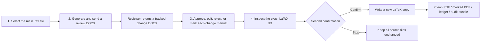

[简体中文](README.md) | **English** | [日本語](README.ja.md)

# LaTeX Word Review

> Let collaborators review a LaTeX paper in Microsoft Word, then bring back only the changes that a human has explicitly approved—without converting the entire returned Word document back into LaTeX.


LaTeX Word Review is a **Windows-only, local-first review assistant**. Your LaTeX project remains the sole authoritative source. A reviewer may use Word Track Changes and comments, but the returned `.docx` is treated as review evidence—not as a replacement source document.

The application turns that evidence into a list of proposed changes. You decide item by item what to accept, reject, edit, or handle manually. Before anything is written, the application shows an exact LaTeX diff and asks for a second confirmation. Approved changes are written to a **new copy** of the project; the original LaTeX and the returned Word file are never overwritten.

## Read this before downloading

This repository currently contains source version **`0.2.0b1`**, a beta candidate using sealed object schema **`v1alpha`**.

- There is currently **no GitHub Release**, **no PyPI package**, and **no publicly distributed signed installer**.
- The repository does include a tested Windows source bootstrap: after downloading and fully extracting the GitHub source ZIP, an ordinary user can start it by double-clicking `Start-Latex-Word-Review.cmd`.
- That double-click route is a source bootstrap, not a conventional signed Windows installer. Its first run prepares a private runtime inside the extracted folder.
- Installer and portable-package candidates have been validated locally, but they are not public binaries. Release is intentionally blocked until the licensing and relinking evidence for the native libraries bundled with Windows `lxml` is complete. See the [Windows binary license audit](docs/reviews/windows-binary-license-audit-2026-07.md).
- GitHub's `main` source ZIP is a moving snapshot, not an immutable release. For reproducible or audited use, advanced users should check out a reviewed full commit hash.

The GitHub documentation is available in Chinese, English, and Japanese. **The current application interface itself is Simplified Chinese.** The language links at the top of this page do not mean that English or Japanese application localization has already shipped.

## Why this project exists

The usual “LaTeX author, Word reviewer” workflow creates a difficult gap:

| Real-world pain point | Project response |
| --- | --- |
| A reviewer sends back dozens of tracked edits that must be copied manually | Parse the returned Word file into a structured ChangeSet containing before/after text, author, time, and source OOXML evidence |
| Converting the entire modified Word document back to LaTeX can damage equations, citations, labels, environments, and document structure | Apply only precisely mapped, approved, ordinary prose edits as local LaTeX patches |
| “Accepting a suggestion” and “writing to the paper” are often treated as one irreversible action | Separate them into two human gates: approve decisions first, then inspect the exact patch and confirm writing |
| PDF figures are awkward to place in Word | Render supported PDF figure pages into canonical PNG review images while leaving the source PDF and LaTeX unchanged |
| A final PDF alone does not explain what changed | Produce a clean result, a source-level marked result when tooling is available, a ledger, and an audit bundle |
| A safe CLI workflow is too tedious for non-programmers | Provide a local browser application with recent-task recovery, file dialogs, task deletion, and a Windows double-click bootstrap |

The central idea is deliberately narrow: **Word is the review interface; the returned Word document is evidence; LaTeX remains authoritative.** A change reaches a new LaTeX copy only when its mapping is provable and the author has passed both approval gates.

## What it can—and cannot—do

### It can

- Select the main `.tex` file and conservatively collect a review snapshot of the project.
- Generate an editable review `.docx` with a stable academic review style.
- Let you choose where to save the Word copy that you send to the reviewer.
- Archive the returned Word original read-only and parse Word Track Changes and comments.
- Present detected changes one by one for acceptance, edited acceptance, rejection, manual handling, or conflict handling.
- Generate an exact patch preview before writing anything.
- Write approved safe text changes into a new LaTeX project copy.
- Compile a clean PDF and a `latexdiff` PDF when a coherent local TeX toolchain is available.
- Create machine-readable and human-readable ledgers plus an audit bundle.
- Resume recent tasks and delete application-owned task records after explicit confirmation.

### It does not

- Convert an entire edited Word document back into LaTeX.
- Promise a pixel-identical copy of the journal PDF inside Word. The generated document is a semantic review document, optimized for readable editing.
- Automatically rewrite formulas, citations, labels, references, environments, figures, moves, formatting-only edits, comments, or ambiguous text.
- Guess a location by fuzzy whole-document matching or by choosing the nearest bookmark.
- Modify the original LaTeX project or the returned Word original.
- Install or update MiKTeX, TeX Live, Word, Pandoc, Perl, LaTeX packages, or system fonts.
- Upload the paper to a project server. The core application runs on `127.0.0.1` and keeps task data on the local computer.
- Provide a public signed installer yet.
- Provide an English- or Japanese-localized application UI yet.

## The four-step workflow



The graphical application hides internal objects such as the ApprovalSet, PatchPlan, hashes, and sealed JSON. Those objects are still rebuilt and verified from disk so that browser state alone cannot authorize a source change.

### Step 1 — Select the paper

Choose the main `.tex` file. The application makes an immutable task snapshot and follows dependencies conservatively. Expensive work runs in the background, and the task is protected against concurrent writes.

The default `academic-review-v1` Word profile uses A4 pages, Times New Roman and SimSun where appropriate, a clear heading hierarchy, justified body text, grid tables, and images that may shrink but are not enlarged. The `tex2word` integration uses a reference document for consistent styling.

This Word file is intended for **review**, not as a clone of the compiled PDF or the target journal layout.

### Step 2 — Generate and retrieve Word

Use the Windows save dialog to choose where the editable review copy should go. The internal sealed baseline remains unchanged, and existing files are not silently overwritten.

Ask the reviewer to:

1. keep **Track Changes** enabled while editing;
2. use comments for discussion rather than treating comments as direct source edits;
3. return the same review round rather than an older generated file;
4. avoid **Accept All Changes**, deleting mapping bookmarks, or flattening the document into a new unrelated `.docx`.

When the returned document is imported, the original is archived read-only. The parser compares the tracked-change view against the sealed baseline. A wrong review round, accepted-all document, damaged anchors, or untracked replacement may stop the workflow instead of producing a questionable draft.

The reviewer may use Word on another computer. Parsing the returned `.docx` does not launch Word. However, generating and freezing live `SEQ`, `REF`, and `PAGEREF` field values requires Microsoft Word on the computer running the application.

### Step 3 — Approve changes one by one

Each proposed change has an explicit decision:

| Decision | Meaning |
| --- | --- |
| Accept | Keep the reviewer's final text if the mapping and safety checks allow it |
| Accept with edited final text | Use text you edit yourself, still subject to the same mapping and safety checks |
| Reject | Keep the original LaTeX text |
| Manual | Record the suggestion, but do not patch it automatically |
| Conflict | Stop automatic handling until the conflict is resolved explicitly |

“Accept all safe text” applies only to currently undecided, exactly mapped, ordinary prose changes. It does not override prior decisions and excludes formulas, citations, references, structural edits, moves, formatting, comments, low-confidence matches, and conflicts.

The first confirmation seals the decisions. It does **not** write to LaTeX.

### Step 4 — Preview and write a new copy

The application builds an exact file-level diff. If an accepted item becomes `accepted_but_blocked`, it must be explicitly changed to manual handling or rejected before the plan can become ready. A no-op plan is reported as such; it is not disguised as a successful rewrite.

After you confirm the exact diff, the application rechecks source hashes, byte ranges, overlap, mapping confidence, and policy. It then writes to a new project copy, verifies the result, and records the ledger and audit data.

## A crucial beta limitation: detection is not the same as safe backfill

A complex real-world returned Word document may be parsed successfully and its tracked changes may appear in the review list, while the export-time source mapping covers too little of the relevant original text. In that situation, the number of changes eligible for safe automatic backfill can be **zero**.

This is a current beta limitation. It is not solved by guessing:

- Detected but unmapped changes remain manual or ledger-only.
- The application does not fuzzy-match the whole paper, select the nearest anchor, or write into a merely plausible location.
- “0 safe backfills” means the safety boundary worked, not that the requested edits were applied.
- Improving mapping coverage for complex LaTeX documents is an active development priority.

The practical consequence is important: this version can already provide useful review evidence and approval organization for complex papers, but it cannot promise automatic backfill for every detected Word change.

## Install and start on Windows

### Recommended for an ordinary user: source ZIP + double-click

You do not need to preinstall Python, `uv`, Git, or administrator tools.

1. Download the [current `main` source ZIP](https://github.com/JIE-jiee/latex-word-review/archive/refs/heads/main.zip).
2. In File Explorer, choose **Extract All**. Do not run the launcher from the ZIP preview.
3. Open the extracted folder.
4. Double-click **`Start-Latex-Word-Review.cmd`**.
5. Allow the first run to finish. It needs an internet connection to prepare the private runtime.
6. On later runs, double-click the same file. Once the runtime is prepared, normal startup does not download or synchronize packages and can run offline.

The bootstrap is intentionally pinned and auditable:

- it downloads the official Windows x64 ZIP for `uv 0.11.16`;
- it verifies the expected file length and a hard-coded SHA-256 digest;
- it installs a fixed 64-bit CPython `3.12.13` runtime inside the extracted project folder;
- it checks `uv.lock` and installs only production dependencies plus the `pdf-figures` extra;
- it does not install development tools such as `pytest`, `mypy`, or PyInstaller;
- it uses no `irm | iex`, no floating `latest` download, and no self-updater;
- after a successful setup, it removes the `uv` archive, `uv.exe`, and bootstrap cache.

The private runtime is stored in `.lwr-runtime` under the extracted folder and is approximately **96 MiB** after cleanup. Application task data is separate, under `%LOCALAPPDATA%\LatexWordReview`.

To reinstall the private runtime, close the application and delete only `.lwr-runtime`, then run the launcher again. This does not delete task data or the original paper.

Because the launcher is currently an unsigned `.cmd` file, Windows may display a warning. Download it only from this repository, fully extract the ZIP, do not use a third-party repackaged launcher, and do not disable Windows security protections to run it.

The first-run bootstrap installs only the application, its Python runtime, and its conversion/preview dependencies. It does **not** install Microsoft Word, MiKTeX, TeX Live, `latexmk`, `latexdiff`, Pandoc, Perl, fonts, or missing LaTeX packages.

### Advanced and reproducible route: source checkout

Use this route when you want to inspect the code, run developer checks, or pin an exact reviewed commit.

```powershell
git clone https://github.com/JIE-jiee/latex-word-review.git
Set-Location latex-word-review

$ReviewedCommit = "PASTE_THE_REVIEWED_FULL_40_CHARACTER_COMMIT_HASH_HERE"
git checkout --detach $ReviewedCommit
if ((git rev-parse HEAD).Trim() -ne $ReviewedCommit) { throw "Commit verification failed" }

uv lock --check
uv sync --frozen --no-default-groups --extra pdf-figures --python 3.12
uv run --no-sync latex-word-review app
```

Replace the placeholder with a full 40-character commit hash that you have reviewed. It is intentionally not a floating tag or branch name.

### What is not publicly downloadable

A maintainer-only frozen Windows candidate may exist during release engineering, but it is ignored by Git and is not included in the source ZIP. Likewise, local PyInstaller/Inno Setup validation does not make an installer public. Until a GitHub Release explicitly publishes an artifact, assume that the supported public route is the source ZIP/bootstrap or an advanced source checkout.

## Word, TeX, and PDF tooling

The following capabilities have different dependencies:

| Capability | Requirement |
| --- | --- |
| Generate the basic review DOCX, import it, approve changes, and write a new LaTeX copy | The prepared application runtime |
| Edit and review the DOCX | Microsoft Word for the reviewer |
| Refresh/freeze live Word fields during export | Microsoft Word on the application computer |
| Compile the clean result PDF | A suitable local TeX installation and the paper's required fonts/packages |
| Compile the source-level marked PDF | The same TeX toolchain plus `latexdiff` |
| Render supported PDF figure pages into Word review images | The `pdf-figures` extra, using PDFium and Pillow |

Automatic PDF verification is conservative. The application proceeds only when it finds a coherent, identifiable MiKTeX setup in which `latexmk` and `latexdiff` come from the same installation root and Perl is an ordinary absolute file. Verification uses private MiKTeX config/data/home/temp locations and does not install or update packages.

TeX Live, mixed TeX installations, missing packages, incomplete Perl setups, or otherwise ambiguous toolchains may leave the task partially complete: the new LaTeX copy and ledger can still exist even when PDF verification is unavailable.

For supported PDF figures, the review document uses a canonical PNG rendering with recorded page, pixel, and hash evidence. The original PDF and LaTeX remain unchanged. The review image is a raster preview, not an editable vector reconstruction. SVG, EPS, unusual page boxes, or dynamically generated figures may require manual handling.

## Output and audit artifacts

A completed task may contain:

| Path | Purpose |
| --- | --- |
| `export/review.docx` | Sealed generated review baseline |
| `receive/original/returned-original.docx` | Read-only archive of the returned Word original |
| `receive/changeset.json` | Parsed review evidence and detected changes |
| `approvals/approval-rN.json` | Versioned human decisions |
| `plans/plan-rN/changes.patch` | Exact proposed source patch |
| `revised-clean/` | New LaTeX project copy after final confirmation |
| `verification/revised-clean.pdf` | Clean compiled result when verification tooling is available |
| `verification/latexdiff.tex` and `.pdf` | Source-level marked result when `latexdiff` is available |
| `ledger/ledger.json` and `.html` | Machine-readable and human-readable change ledger |
| `audit.zip` | Portable audit evidence bundle |

LaTeX does not have Word-style review balloons. Approved safe text appears in `revised-clean`. The `latexdiff` output marks actual LaTeX source differences only. If the plan is a no-op, there are no artificial revision marks. Reviewer names, timestamps, comments, and decisions belong in the ChangeSet and ledger rather than being fabricated into the marked PDF.

## Task storage, resume, and deletion

By default, tasks are stored under:

```text
%LOCALAPPDATA%\LatexWordReview\runs\session_<random>
```

The home page lists recent tasks. You can reopen a task and let the application verify its sealed state before continuing. You can also delete an application-owned recent task after an irreversible confirmation. An active task cannot be deleted, and deletion does not remove the original LaTeX project or a Word copy that you saved elsewhere.

Recovery and re-approval reconstruct state; they never invent a decision on your behalf.

Closing the browser tab does not necessarily stop the local service. Use **Exit application** in the interface when you are finished. When running from source in a console, `Ctrl+C` stops the service. Advanced users may set a separate task location with the `app --data-root` option.

## Safety and privacy model

- Source snapshots, generated baselines, and returned Word originals are SHA-bound and treated as immutable evidence.
- Automatic patches are limited to exactly mapped ordinary prose at confidence **`>= 0.99`**.
- Formulas, citations, labels, references, environments, figures, structural changes, moves, formatting, comments, conflicts, and low-confidence mappings require manual handling.
- The two confirmation gates are independent: approving a review decision does not authorize a disk write.
- The final write rechecks hashes, byte ranges, overlap, source policy, and the current sealed state.
- The original project is never the output target; a new copy is created.
- The local web service binds to `127.0.0.1` and applies Host, Origin, cookie, CSRF, CSP, and request-body checks.
- The core workflow does not actively upload papers. Real tasks are treated as `local_private`.

An optional Codex Skill can orchestrate the same library and CLI, but the Skill is intentionally thin and cannot bypass either human gate. If you use an AI agent, its ability to see outputs or evidence is governed by the agent platform's policy. For sensitive papers, use the local application directly and do not share private task folders with an agent.

## Architecture and upstream foundations

The project does not attempt to reinvent every conversion component:

- `tex2word` is the default LaTeX-to-Word conversion foundation.
- `pypdfium2` and Pillow provide controlled PDF-page rendering for review figures.
- OpenRefine influenced the recoverable local-browser workflow model.
- PyInstaller and Inno Setup are used for future Windows binary recipes, not as evidence that a public binary has shipped.
- Pandoc, `docx-revisions`, the Open XML SDK, and Open XML PowerTools are treated as upstream references or comparison oracles where appropriate.

The project-specific value is the safety layer around those tools: immutable task runs, SourceMap evidence, reject-view baseline comparison, versioned schemas, per-item approval, exact local patching, verification, and an auditable ledger.

Upstream licensing, maintenance status, tests, gaps, and adopt/wrap/contribute/self-build decisions are recorded under [`docs/`](docs/). Third-party notices are collected in [`THIRD_PARTY_NOTICES.md`](THIRD_PARTY_NOTICES.md).

## Current validation status

The latest source-candidate snapshot recorded in the project documentation on **2026-07-21** reported:

- `1209 passed, 9 skipped, 0 failed`;
- branch coverage of `90.47%`;
- passing Ruff lint, format checks, strict mypy checks, and `uv lock --check`.

These results describe that tested source snapshot. They are not a claim that every LaTeX package, journal template, Word editing pattern, or Windows configuration is already supported.

Current development priorities include:

- broader source mapping coverage for complex real-world LaTeX;
- better Word review layout without pretending to reproduce journal typesetting;
- clearer diagnostics when a change is detectable but not safely mappable;
- more public, redistributable fixtures;
- completion of the Windows binary licensing gate.

## Vibe Coding and OpenAI Codex disclosure

This project was created through **Vibe Coding with OpenAI Codex**.

The maintainer drove the problem definition, real-world workflow, corrections, safety boundaries, and release decisions. AI agents assisted with upstream research, architecture, implementation, tests, diagnostics, and documentation.

This disclosure records provenance; it is **not** a correctness guarantee. The project is beta software and may still contain conversion, layout, performance, packaging, and edge-case defects. Back up your work, keep the original project unchanged, and test with copies before relying on the output.

The project welcomes careful human review. If you find a problem, please open an Issue with the smallest sanitized reproduction you can create, or send a focused Pull Request. Do not upload a private paper, a returned reviewer document, reviewer identities, or an application task folder.

Before contributing, read [`CONTRIBUTING.md`](CONTRIBUTING.md) and [`SECURITY.md`](SECURITY.md).

## License

Project source code is licensed under the [Apache License 2.0](LICENSE). Third-party components retain their own licenses; see [Third-Party Notices](THIRD_PARTY_NOTICES.md). The source license does not override the separate release gate for distributing a bundled Windows binary.

---

In one sentence: **this project is a safety-conscious bridge from Word review evidence to explicitly approved, exact, local changes in a new LaTeX copy—not a magic whole-document Word-to-LaTeX converter.**
