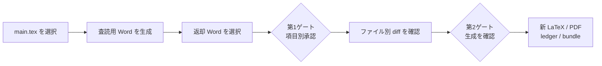

# LaTeX Word Review

[简体中文](README.md) | [English](README.en.md) | [日本語](README.ja.md)

[](https://github.com/JIE-jiee/latex-word-review/actions/workflows/ci.yml)
[](https://github.com/JIE-jiee/latex-word-review/actions/workflows/windows-source-bootstrap.yml)
[](docs/compat/platform-support.md)
[](pyproject.toml)
[](LICENSE)

**修正済みの Word を丸ごと LaTeX に再変換するのではなく、Word の変更履歴を安全に LaTeX へ戻します。**

LaTeX Word Review は、Windows 専用のローカル査読支援ツールです。論文の正本はあくまで
LaTeX のままにし、指導教員や共同執筆者には Microsoft Word の「変更履歴」と「コメント」だけを
使ってもらいます。返却された Word は変更単位に分解され、著者による項目別承認、正確な diff の
確認、二度目の明示的な確認を経たものだけが、新しい LaTeX 作業コピーへ反映されます。

> [!IMPORTANT]
> この README は日本語ですが、**現在のアプリ画面は中国語です**。GitHub の説明文を
> 中国語・英語・日本語で切り替えられることと、アプリ本体の UI ローカライズは別です。
> 現時点では英語版・日本語版のアプリ UI を提供しているとは表明していません。

> [!NOTE]
> 本プロジェクトは、実際の LaTeX–Word 共同執筆で生じた問題を出発点に、メンテナー主導の
> **Vibe Coding と OpenAI Codex との協働**によって開発されました。メンテナーが要件、方向、
> 安全境界、公開判断を担い、AI コーディング Agent が調査、設計、実装、テスト、文書作成を
> 支援しています。Vibe Coding は開発経緯の開示であり、正しさを保証するものではありません。
> 詳細は[開発経緯と Vibe Coding の記録](docs/development-provenance.md)を参照してください。

> [!WARNING]
> 現在のソース版は `0.2.0b1` beta 候補で、封印オブジェクトにはまだ `v1alpha` 契約を使用して
> います。GitHub Release と PyPI 配布はまだありません。GitHub のソース ZIP には検証済みの
> Windows ダブルクリック起動口がありますが、これはソース bootstrap であり、署名済み
> インストーラーではありません。Windows installer と portable ZIP はローカル候補まで検証済み
> ですが、lxml の Windows 静的ネイティブ依存に関するライセンス資料と再リンク手段の確認が
> 完了していないため、**バイナリアセットは公開していません**。詳細は
> [Windows バイナリライセンス監査](docs/reviews/windows-binary-license-audit-2026-07.md)を参照してください。

## 解決したい現実の問題

| 現実の問題 | よくある方法のリスク | 本プロジェクトの考え方 |
|---|---|---|
| Word に数十件の変更履歴がある | 手作業の転記で漏れや誤記が起きる | 著者、時刻、変更前後、OOXML 証拠を持つ `ChangeSet` を作る |
| 修正済み Word を全文 LaTeX 化する | マクロ、数式、引用、ラベル、テンプレートが書き換わる | 承認済みで正確に位置を証明できる平文だけを局所的に直す |
| 承認と実際の書き込みが同時に起きる | 一度の誤操作で論文が変わる | 独立した二つの人間ゲートを設け、新しいコピーにだけ書く |
| PDF の図を Word に入れにくい | ページ違い、欠落、追跡不能な変換が起きる | PDF の指定ページから canonical PNG を派生し、画素とハッシュを記録する |
| 最終 PDF しか残らない | 誰が何を変えたか追跡できない | clean LaTeX、latexdiff、台帳、監査 bundle を同時に残す |
| CLI が複雑 | 多数のコマンドと JSON パスを利用者が管理する | `ApplicationSession` とローカル画面が処理と復旧をまとめる |

中心となるアイデアは、汎用コンバーターを一から書き直すことではありません。**Word を査読用の
画面として使い、返却ファイルを構造化された証拠へ変換し、「証明できる位置対応・二つのゲート・
新しいコピー・監査チェーン」によって安全に戻す**ことです。

## 4 ステップの査読フロー

インストール候補、portable 候補、ソース版は、いずれも同じローカル画面と安全な中核処理を
使用します。現在の画面表示は中国語です。

1. **`main.tex` を選ぶ**：Windows のファイル選択画面で主ファイルを選び、読み取り専用
   スナップショットと事前検査を作成します。
2. **Word を作成し、返却稿を取り込む**：`review.docx` を査読者へ渡し、戻ってきた `.docx` を
   選択します。
3. **変更を一件ずつ判断する**：変更前後、著者、時刻、ソース位置、信頼度、リスクを見て、
   採用・修正して採用・不採用・手動対応などを決めます。
4. **diff を確認して成果物を作る**：一つ目のゲートで判断を封印し、ファイル別 diff を確認した
   後、二つ目のゲートで新しい LaTeX、PDF、台帳、監査 bundle の生成を明示的に許可します。



通常の利用者が `ApprovalSet`、`PatchPlan`、ハッシュ、JSON の保存先を手作業で管理する必要は
ありません。ただし、内部では不変の証拠を保存し、復旧時にもブラウザーの一時状態ではなく、
ディスク上の封印済みオブジェクトを再検証します。

## 今すぐ使う方法

### 一般の Windows ユーザー：ZIP を展開してダブルクリック

1. このリポジトリの [GitHub ソース ZIP](https://github.com/JIE-jiee/latex-word-review/archive/refs/heads/main.zip) をダウンロードします。
2. エクスプローラーで「すべて展開」を実行します。ZIP のプレビュー画面から直接起動しないでください。
3. 展開先のルートにある **`Start-Latex-Word-Review.cmd`** をダブルクリックします。
4. 初回だけインターネットへ接続した状態で初期化の完了を待ちます。その後、ブラウザーで
   ローカル画面が開きます。二回目以降は同じファイルをダブルクリックするだけで、準備済みの
   依存関係を再ダウンロードせず、オフラインでも起動できます。

一般ユーザーは **Python、uv、Git を事前に入れる必要がなく、管理者権限も不要**です。初回起動は
公式の uv `0.11.16` Windows x64 ZIP を固定 URL から取得し、長さとハードコード済み SHA-256 を
照合します。その uv が固定の 64 bit CPython `3.12.13` を準備します。続いて `uv.lock` と
プロジェクト定義の一致を検査し、ロックされた本番依存と `pdf-figures` extra だけを入れます。
pytest、mypy、PyInstaller などの開発ツールは入りません。`irm | iex`、`latest`、自動更新も
実行しません。

専用ランタイムは展開フォルダー内の `.lwr-runtime` に置かれます。現在の実測では、初期化後の
典型サイズは約 **96 MiB** です。成功後は uv のダウンロード ZIP、`uv.exe`、依存キャッシュを
削除します。論文のタスクデータは `%LOCALAPPDATA%\LatexWordReview` に保存され、ランタイムとは
分離されています。環境を作り直す場合は、プログラムを終了して `.lwr-runtime` だけを削除し、
再度ダブルクリックしてください。タスクデータや元論文は削除されません。

現時点では署名済みインストーラーではないため、Windows がインターネット由来の `.cmd` に警告を
表示する場合があります。このリポジトリから取得した ZIP を完全に展開して使い、第三者が配布する
同名ファイルは実行しないでください。未知のファイルを動かすために Windows の安全機能を無効化
しないでください。ソース ZIP は `main` の更新に追随し、不変の正式 Release ではありません。

> [!NOTE]
> 初回 bootstrap が用意するのは、本プログラム、Python、変換・プレビュー用依存だけです。
> Microsoft Word、MiKTeX、TeX Live、`latexmk`、`latexdiff`、Pandoc はインストールしません。
> 基本的な Word 生成は利用できますが、最終 PDF の生成や Word の live field 更新には、対応する
> TeX ツールまたは Microsoft Word が別途必要です。

### 上級者：監査したソース commit を手動で実行

特定の不変 commit を固定して監査したい場合は、Git、uv、既存 Python を使う方法もあります。

```powershell
git clone https://github.com/JIE-jiee/latex-word-review.git
Set-Location latex-word-review
$ReviewedCommit = "PASTE_THE_REVIEWED_40_CHARACTER_COMMIT_SHA_HERE"
git checkout --detach $ReviewedCommit
if ((git rev-parse HEAD).Trim() -ne $ReviewedCommit) { throw "Commit verification failed" }
uv lock --check
uv sync --frozen --no-default-groups --extra pdf-figures --python 3.12
uv run --no-sync latex-word-review app
```

プレースホルダーは、実際に確認した 40 文字の commit SHA に置き換えてください。ダブルクリック
起動口は Git を必要とせず、`pyproject.toml` や `uv.lock` を書き換えません。

### 公開ソース bootstrap とメンテナー用ローカル候補の違い

| 形態 | 普通の利用者が使えるか | 実体 | 現在の公開状態 |
|---|---:|---|---|
| GitHub ソース ZIP | はい | 初回に固定 Python と依存を準備するソース bootstrap | 公開済み。署名済みインストーラーではない |
| メンテナーのローカル凍結候補 | いいえ | `.lnk` と `output\local-windows` 内の PyInstaller onedir | Git 管理外。GitHub ZIP には含まれない |
| 現在ユーザー向け setup | まだ不可 | ダブルクリック型 Inno Setup 候補 | ローカル構築・静的検証済み。未公開 |
| Portable ZIP | まだ不可 | 展開して `LatexWordReview.exe` を起動する候補 | ローカル実行検証済み。未公開 |

ローカル凍結候補が既にあるメンテナー環境では、リポジトリ直下の
`LaTeX Word Review（双击启动）.lnk` または
`output\local-windows\Start-Latex-Word-Review.cmd` を使えます。これは通常の GitHub
利用者向け配布物ではありません。

ローカル `0.2.0b1` Windows x64 候補の典型サイズは、setup 約 **20.5 MiB**、portable ZIP
約 **31.9 MiB**、展開・インストール後のプログラム約 **63 MiB**（約 438 ファイル）です。
Python ランタイム、本プロジェクト、`tex2word`、Pillow、PDFium、Schema、画面資源を含みますが、
Microsoft Word、MiKTeX、Pandoc、Playwright ブラウザー、開発ツールは含みません。これらの
数値はローカル候補の参考値であり、公開ダウンロードを示すものではありません。

2026-07-21 時点のソース候補は Windows 上のローカル回帰で **1209 passed、9 skipped、
0 failed**、branch coverage **90.47%** を記録し、Ruff、format、strict mypy、
`uv lock --check` も通過しています。これは beta に未知の不具合がないことを保証しません。

## 画面上の処理

### 1. 論文を選び、査読用 Word を生成

「新規査読」を選び、主 `.tex` を指定します。プログラムはそのファイルがあるディレクトリを
起点に依存を保守的に探索し、ディレクトリ外参照やリンクによる逸脱を拒否します。ユーザーデータ
領域に新しいタスクと読み取り専用スナップショットを作成し、事前検査後に Word を生成します。
時間のかかる処理はローカルのバックグラウンドで実行され、同一タスクへの同時書き込みは一つに
限定されます。

標準の査読稿は、コードから決定的に生成され SHA-256 で固定された `academic-review-v1` 書式を
使います。A4 一段組、欧文 Times New Roman、中国語 SimSun、明確な見出し階層、両端揃えを基本と
し、画像は必要な場合だけ縮小し、表は明示的なグリッドと控えめなセル余白を使います。
`tex2word 1.0.5` の公開 `reference_doc` API を利用し、未知の Word テンプレートを配布物へ
混入させません。テンプレートの読み込みが検証できなければ、既定書式へ黙って退避せず停止します。

この Word は修正しやすい**意味上の受け渡し稿**であり、LaTeX PDF や投稿先ジャーナルの版面を
完全再現するものではありません。

### 2. Word で査読してもらい、返却稿を選ぶ

内部の封印済み基線は検査目的で開けます。「別の場所へ保存」を使うと、Windows の保存画面から
送付・編集用 `.docx` コピーを新規作成できます。内部基線を移動・変更せず、既存ファイルも上書き
しません。

査読者には「校閲 → 変更履歴」を有効にしたまま、本文変更には変更履歴、議論にはコメントを使って
もらってください。「すべての変更を反映」、位置特定用 bookmark の削除、旧 `.doc` 形式での保存は
避けてください。返却された `.docx` を選ぶと、プログラムは最初に原本を読み取り専用で保存し、
reject view がエクスポート基線と一致することを証明します。Accept All、変更履歴を切った未追跡
編集、別ラウンドの文書、壊れた bookmark は、推測で処理せず停止します。

査読者が別の Windows PC で Word を使っても構いません。`SEQ`、`REF`、`PAGEREF` などの live
field を含む通常の論文では、プログラムを実行する PC にも Microsoft Word が必要です。Word は
field を更新し、固定するために使われます。Word を同梱または黙ってインストールすることはなく、
必要なのに見つからない場合は、古い field を含む文書を渡さず明示的に停止します。返却 DOCX の
読み取り解析だけで Word を起動することはありません。

### 3. 第1ゲート：変更を一件ずつ判断

各カードには変更前後、著者、時刻、前後の文脈、ソース位置、信頼度、安全分類が表示されます。

| 判断 | 意味 |
|---|---|
| 採用 | Word の文言に同意する。自動適用できる保証ではない |
| 修正して採用 | 方向に同意し、最終文言を入力する |
| 不採用 | 元の LaTeX 文言を保つ |
| 手動対応 | 証拠を残し、別コピーで後から処理する |
| 判断不能 | 証拠または意味が衝突しているため、現在は適用しない |

「安全な本文変更をすべて採用」は、未判断かつ正確に対応づけられた通常本文だけを対象とします。
既存の個別判断を上書きせず、数式、引用、構造、move、書式、コメント、低信頼度、衝突を含みません。
「承認を完了してパッチをプレビュー」は判断を封印するだけで、LaTeX を変更しません。

### 4. 第2ゲート：diff を確認して新しいコピーを作る

ファイル別 unified diff と、自動・手動・不採用・衝突の集計を表示します。
`accepted_but_blocked` が一つでもあれば適用へ進まず、利用者が「再承認」を選び、その項目を
手動対応または不採用に変える必要があります。既存判断と旧証拠は保持されます。

計画が ready または noop になってから、確認欄を選び、「新しい LaTeX コピーへ反映して成果物を
生成」を実行します。プログラムは計画ハッシュ、ソースハッシュ、UTF-8 byte 範囲、重複、安全
ポリシーを再確認し、apply、verify、ledger、bundle を順に実行します。ドリフトがあれば停止します。

## 自動反映の安全境界と既知の制限

自動反映は「Word で見つけた変更」すべてを対象にしません。次の条件をすべて証明できる通常本文
だけが候補です。

- SourceMap 上で位置が一意に決まり、信頼度が少なくとも 0.99 である。
- LaTeX の数式、コマンド、環境、ラベル、引用、構造境界を横切らない。
- 元ソースの UTF-8 byte 範囲とハッシュが変化していない。
- 重複、競合、壊れた bookmark、未追跡変更がない。
- 利用者が項目を承認し、さらに diff を確認して第2ゲートを通過する。

数式、引用、ラベル、環境、図表、move、書式、コメント、field code、低信頼度項目は証拠と台帳へ
残しますが、既定では手動対応です。

特に、**実際の複雑な Word 返却稿を正常に読み取り、変更自体を認識できても、LaTeX 側の安全な
位置対応が十分に作れなければ、safe backfill が 0 件になることがあります。** これは「変更が
なかった」という意味ではありません。認識した変更は `ChangeSet` と ledger に残り、
`manual_high_risk`、未対応、衝突などとして表示されます。安全性を満たさない変更を推測で自動反映
しないのが本プロジェクトの設計です。

そのほかの主な制限は次のとおりです。

- Word 査読稿は意味上の受け渡し稿であり、LaTeX PDF の版面複製ではない。
- 複雑なテンプレート、独自マクロ、特殊な field、画像操作には未対応または手動対応部分がある。
- text-patch 用 reject-view 基線の検証は、DOCX 内のあらゆるオブジェクトが完全に同値であるという
  主張ではない。
- Word の吹き出しを LaTeX ソースへ埋め込むことはない。著者、時刻、コメントは台帳に残る。
- 実際のソース差分がない noop タスクには、見かけだけの latexdiff マークを作らない。
- beta には未発見の互換性、レイアウト、性能、境界条件の問題が残る可能性がある。
- 修正済み Word 全文から LaTeX を再生成して元稿を上書きする機能ではない。

必ず原論文をバックアップし、生成された新しいコピーと PDF を確認してから採用してください。

## データ、復旧、削除、終了

既定のデータルートは次のとおりです。

```text
%LOCALAPPDATA%\LatexWordReview\
└── runs\
    └── session_<ランダム識別子>\
```

公開ソース版、将来の正式 portable、installer はここを使います。メンテナーのローカル一括起動
候補だけは例外で、`output\local-windows\user-data` と、その下の `temp` を使用します。

- **復旧**：アプリを開き直し、「最近のタスク」から続行します。タスクを開くと全封印証拠を再検証します。
- **削除**：タスクカードから不可逆削除を明示的に確認します。実行中タスクは削除できません。
  プログラム所有のタスクディレクトリだけが対象で、元論文や別の場所に保存した Word は消しません。
- **中断・計画ブロック**：明示的な復旧または再承認入口を使います。既存判断を上書きしたり、
  ゲートを飛び越えたりしません。
- **部分完了**：TeX や `latexdiff` が不足しても、安全に生成済みの LaTeX と証拠は保持します。
  ツールを準備後、新しい検証試行を作れます。以前の失敗記録は上書きしません。
- **ブラウザータブを閉じる**：ローカルサービスは終了しません。
- **プログラム終了**：画面の終了ボタンを使います。処理中なら安全な終了点まで待ちます。
  ソース版コンソールでは `Ctrl+C` も使えます。

上級者は `latex-word-review app --data-root <ディレクトリ>` でデータルートを変更できます。

## 生成される主な成果物

| 成果物 | 用途 |
|---|---|
| `export/review.docx` | 安定 bookmark と Track Changes を備えた査読用 Word |
| `receive/original/returned-original.docx` | 返却ファイルの読み取り専用原本保存 |
| `receive/changeset.json` | 挿入、削除、置換、move、書式、コメントの証拠 |
| `approvals/approval-rN.json` | 項目別判断と不変バージョンチェーン |
| `plans/plan-rN/changes.patch` | 第2ゲート前に確認する正確な diff |
| `revised-clean/` | 許可された安全な本文パッチだけを含む新 LaTeX コピー |
| `verification/revised-clean.pdf` | 修正後の clean PDF |
| `verification/latexdiff.tex` / `.pdf` | 元稿と修正稿の派生差分。PDF はコンパイル成功時のみ |
| `ledger/ledger.json` / `.html` | 著者、時刻、判断、パッチ、検証の台帳 |
| `audit.zip` | allowlist に限定され、オフラインでハッシュ検証できる監査 bundle |

`revised-clean/` には承認済みかつ安全に適用できた本文だけが入ります。実際の差分があり検証に
成功した場合、`latexdiff.tex/.pdf` が追加・削除を可視化します。Word の著者、時刻、コメントは
ChangeSet と ledger に保存され、latexdiff の代用にはしません。

## Word、TeX、PDF 画像の外部依存

| 機能 | 必要なもの |
|---|---|
| DOCX の生成・解析、承認、新 LaTeX の作成 | ソース bootstrap が準備する Python ランタイム |
| 返却稿の作成 | 査読者側の Microsoft Word for Windows |
| clean PDF の生成 | `latexmk`、論文に合う TeX engine、font、package |
| 変更マーク付き PDF | 上記に加えて `latexdiff` |
| PDF 図の Word 取り込み | `pdf-figures` extra の PDFium/Pillow |

Windows の自動 PDF 検証は、同一であることを証明できる MiKTeX toolchain だけを現在の対象に
しています。`latexmk` と `latexdiff` は同じ MiKTeX ルートに属し、`PATH` には通常の絶対
ファイルとして解決できる Perl が必要です。プログラムは私有の MiKTeX 設定、データ、HOME、
一時ディレクトリを使い、package を自動インストール・更新しません。TeX Live、混在 toolchain、
不足 package、Perl 不在は部分完了または明示的ブロックになり、生成済み LaTeX は保持されます。

PDF 図は派生 overlay 内だけで、指定ページ、crop、rotation を canonical PNG に変換します。
元 PDF と `.tex` は変えません。Word 側は編集可能なベクターではなくラスターの査読プレビューです。
SVG、EPS、`pagebox`、動的画像操作を安全に解釈できない場合は手動対応になります。

## 安全性、プライバシー、Codex Skill

- 元 LaTeX、エクスポート基線、返却 Word 原本は SHA-256 で結び付け、変更しません。
- 自動パッチは一意で高信頼度の通常本文だけに限定します。
- ローカルサービスは `127.0.0.1` のみに bind し、Host、Origin、Cookie、CSRF、CSP、要求サイズを検査します。
- 中核プログラムは論文を能動的にアップロードせず、実タスクは既定で `local_private` です。
- 公開 Issue や PR に私人論文、指導教員の Word 原本、特定可能な査読情報を添付しないでください。

任意の `$latex-word-review` Skill は薄い編成レイヤーです。通常は
`latex-word-review app` を起動し、利用者自身がローカル画面でファイル選択、項目別判断、diff 確認を
行います。Skill はどちらの人間ゲートも代行・迂回できません。Codex Agent を使う場合、利用する
製品や組織のデータ方針に従ってコマンド出力や査読証拠が Agent から見える可能性があります。
機密論文ではローカル画面だけを使う選択肢があります。

```powershell
codex plugin marketplace add JIE-jiee/latex-word-review --ref <reviewed-tag-or-commit>
codex plugin add latex-word-review@personal
```

## 採用している上流プロジェクト

| 上流 | 利用方法 |
|---|---|
| [tex2word](https://github.com/yfyang86/tex2word) | 既定 LaTeX→DOCX backend。解析、OMML、画像、表、field を再利用 |
| [pypdfium2](https://github.com/pypdfium2-team/pypdfium2) / Pillow | PDF ページ描画と canonical PNG |
| [OpenRefine](https://github.com/OpenRefine/OpenRefine) | 「ローカルサービス + ブラウザー + 復旧可能なホーム」の設計を参考にする。コードはコピーしない |
| [PyInstaller](https://pyinstaller.org/) / [Inno Setup](https://jrsoftware.org/isinfo.php) | 同一ソースからの portable・installer 候補 |
| Pandoc、docx-revisions、Open XML SDK、PowerTools | 比較 backend、契約実験、OOXML oracle |

本プロジェクト自身が、不変の実行記録、SourceMap、reject-view 基線、バージョン化 Schema、項目別
承認、局所パッチ、検証、監査チェーンを実装します。方針は
[ADR-0001](docs/adr/0001-upstream-strategy.md) と
[Windows 製品 ADR](docs/adr/0003-windows-product-experience.md) に記録しています。

## プロジェクトの状態とコントリビューション

本プロジェクトは継続開発中です。複雑な LaTeX template への互換性、Word 査読稿のレイアウト、
エラー診断、公開テスト例、Windows バイナリのライセンス確認を今後も改善します。

[GitHub Issues](https://github.com/JIE-jiee/latex-word-review/issues) には、最小化・匿名化され、
再現可能な問題を投稿してください。[Pull Requests](https://github.com/JIE-jiee/latex-word-review/pulls)
によるコード、テスト、文書、互換性、安全性の改善も歓迎します。参加前に
[CONTRIBUTING.md](CONTRIBUTING.md)、[SECURITY.md](SECURITY.md)、
[THIRD_PARTY_NOTICES.md](THIRD_PARTY_NOTICES.md) を確認してください。

AI 支援を使ったことは、変更内容を理解し、重要な関与を開示し、検証を提示し、最終内容に責任を
持つ義務を免除しません。一般の不具合は
[GitHub Issues](https://github.com/JIE-jiee/latex-word-review/issues)、安全性の問題は
[非公開の脆弱性報告](https://github.com/JIE-jiee/latex-word-review/security/advisories/new)を利用してください。

このリポジトリのコードライセンスは [Apache License 2.0](LICENSE) です。第三者依存の条件は
[THIRD_PARTY_NOTICES.md](THIRD_PARTY_NOTICES.md) を参照してください。

## 上級 CLI と関連文書

通常の利用者に完全な CLI は不要です。自動化、旧フローの復旧、監査では
[CLI と実行ディレクトリ契約](docs/reference/cli.md) を参照してください。公開の自作 fixture は
次のコマンドで実行できます。

```powershell
uv sync --frozen --group fixture --extra pdf-figures --python 3.12
uv run --frozen python scripts/run_public_e0_cli_demo.py --fixture-profile portable --skip-verification
```

`portable` fixture は `SEQ`、`REF`、`PAGEREF` live field を生成しない合成論文です。そのため
Microsoft Word のないクリーンな Windows でも
`snapshot → export → archive → ingest → approve → plan → apply` を実行できます。これは生産時の
安全要件を弱めるスイッチではありません。`--fixture-profile full` は live field を含む完全 E0 を
使い、Microsoft Word がなければ安全に失敗します。詳しくは
[公開 E0 チュートリアル](docs/tutorial-public-e0.md)を参照してください。

- [中国語 Windows 完全ガイド](docs/guide.zh-CN.md)
- [English Windows Quick Start](docs/quick-start-windows.md)
- [文書インデックス](docs/README.md)
- [脅威モデル](docs/security/threat-model.md)
- [対応プラットフォーム](docs/compat/platform-support.md)
- [Windows バイナリライセンス監査](docs/reviews/windows-binary-license-audit-2026-07.md)

開発時の基本チェック：

```powershell
uv run --frozen ruff check .
uv run --frozen ruff format --check .
uv run --frozen mypy
uv run --frozen pytest --cov=latex_word_review --cov-report=term-missing
```
