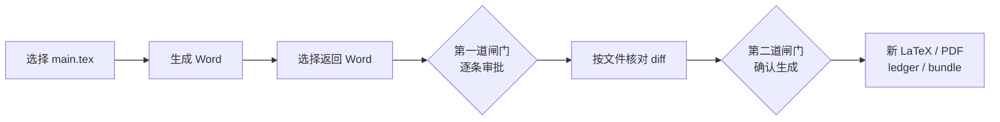

# LaTeX Word Review

[](https://github.com/JIE-jiee/latex-word-review/actions/workflows/ci.yml)
[](docs/compat/platform-support.md)
[](pyproject.toml)
[](LICENSE)

**把 Word 修订安全地带回 LaTeX，而不是把修订后的 Word 整篇再转一次。**

LaTeX Word Review 是一个仅面向 Windows 的本机审阅助手。论文作者继续把 LaTeX 当作唯一
权威源，导师或合作者只需在 Microsoft Word 中使用“修订”和“批注”。返回的 Word 会先拆成
逐条修改，经过人工审批、精确 diff 预览和第二次确认后，才可能写入新的 LaTeX 工作副本。

> [!NOTE]
> 本项目源自真实的 LaTeX–Word 协作痛点，并主要通过维护者驱动的
> **Vibe Coding 与 OpenAI Codex 协作**完成。维护者提出需求、纠正方向、设定安全边界并
> 决定发布；AI 编程 Agent 参与调研、设计、编码、测试和文档。Vibe Coding 是开发来源
> 说明，不是正确性保证。详见[开发来源与 Vibe Coding 记录](docs/development-provenance.md)。
> 当前 beta 仍可能存在未发现的转换兼容性、排版、性能或边界问题，请先备份论文并始终在
> 副本上验证结果。项目会在后续版本持续修正和完善，也欢迎通过
> [Issue](https://github.com/JIE-jiee/latex-word-review/issues) 与
> [Pull Request](https://github.com/JIE-jiee/latex-word-review/pulls) 参与测试、文档、兼容性和安全改进。

> [!WARNING]
> 当前源码版本为 `0.2.0b1` beta 候选，密封对象仍使用 `v1alpha` 契约。项目尚未创建
> GitHub Release，也未发布到 PyPI。Windows 安装器和 portable ZIP 已完成本地构建、静态
> 校验与冻结程序运行验收；本轮未执行最终安装器的安装/卸载，
> 但 lxml Windows 静态原生依赖的许可证材料与可重链接路径尚未闭环，因此
> **目前不公开上传二进制资产**。GitHub 现阶段只提供源码、构建脚本和 CI 证据。详见
> [Windows 二进制许可证审计](docs/reviews/windows-binary-license-audit-2026-07.md)。

## 四步完成一轮审阅

安装版、portable 与源码方式都打开同一个本机中文界面：

1. **选择 `main.tex`**：Windows 文件选择器确认论文，程序创建只读快照并预检。
2. **生成并收回 Word**：打开 `review.docx` 交给审阅者；收到文件后选择返回的 `.docx`。
3. **逐条审批**：查看修改前后、作者、时间、源位置和风险，逐项决定；受限批量操作只包含
   精确映射的安全正文。
4. **核对 diff 后生成结果**：第一道闸门密封审批决定；第二道闸门展示按文件 diff，用户
   再次确认后才生成新的 LaTeX、PDF、账本和审计包。



界面不会要求普通用户管理 `ApprovalSet`、`PatchPlan`、哈希或 JSON 路径。后台仍保存这些
不可变证据，恢复时从磁盘重新核验，而不是依赖浏览器缓存猜测状态。

## 现在怎样运行

### 当前维护者工作区：直接双击

如果仓库根目录已经存在本机生成的
`LaTeX Word Review（双击启动）.lnk`，直接双击即可；备用入口是
`output\local-windows\Start-Latex-Word-Review.cmd`。这份工作区便携交付不需要
Python、uv 或 Git，程序、任务数据和临时文件都留在 `output\local-windows`。
它属于本地验收产物，受 Git 忽略，并不是 GitHub 上已经公开的二进制下载。
维护者重建冻结候选后，使用 `scripts\deploy-local-windows.ps1` 原子更新该本地程序；脚本先
逐项复核 `CONTENTS.sha256`，并在同目录 stage/rollback 后替换 `app`，不会改动既有
`user-data`、启动器或根快捷方式。

### 当前公开可用：从源码启动本机界面

由于公开二进制仍受许可证审计阻断，当前可复现入口是固定一个已审核源码提交：

```powershell
git clone https://github.com/JIE-jiee/latex-word-review.git
Set-Location latex-word-review
$ReviewedCommit = "PASTE_THE_REVIEWED_40_CHARACTER_COMMIT_SHA_HERE"
git checkout --detach $ReviewedCommit
if ((git rev-parse HEAD).Trim() -ne $ReviewedCommit) { throw "Commit verification failed" }
uv sync --frozen --extra pdf-figures --python 3.12
uv run --frozen latex-word-review app
```

把 `$ReviewedCommit` 换成实际审核过的完整 40 位 commit SHA。占位值会明确失败，避免
不知情地跟随移动中的 `main`。此方式需要 Windows、Git、uv 和 Python 3.12/3.13；
界面打开后不再需要手工执行审阅链的十几条命令。

### 许可证闭环后提供：安装版与 portable

| 形式 | 使用方式 | Python / Git | 当前公开状态 |
|---|---|---:|---|
| 当前用户安装器 | 双击 setup；安装结束可立即启动，以后从桌面或开始菜单打开 | 不需要 | 构建与静态校验通过；本轮未执行安装；暂不公开上传 |
| Portable ZIP | 解压后双击 `LatexWordReview.exe` | 不需要 | 冻结程序运行验收通过；暂不公开上传 |
| 源码界面 | `uv run --frozen latex-word-review app` | 需要 | 当前公开可用 |

安装器不请求管理员权限；portable 与安装器使用同一份 PyInstaller onedir 字节。两者都把
任务放到用户数据目录，而不是安装/解压目录。未来若公开的 Beta 仍没有可信 Authenticode
签名，Windows SmartScreen 可能显示“未知发布者”。请先核对发布页 SHA-256、版本和源码，
不要把提示当作可以无条件忽略的弹窗。

### 当前候选大约多大

本地 `0.2.0b1` Windows x64 候选的典型体积为：

| 资产 | 典型大小 |
|---|---:|
| setup 安装包 | **约 20.5 MiB** |
| portable ZIP | **约 31.9 MiB** |
| 安装或解压后的程序目录 | **约 63 MiB**（约 438 个文件） |

该候选使用固定的 64 位 CPython 3.12.13 冻结。体积会随版本、PyInstaller、PDFium 和依赖
更新而变化。程序内含 Python 运行时、本项目、`tex2word`、Pillow、PDFium、Schema 和界面
资源；不含 Microsoft Word、MiKTeX、Pandoc、Playwright 浏览器或开发工具。
每次构建的精确字节数与 SHA-256 以该次 `artifacts/SHA256SUMS.txt` 和程序目录内的
`CONTENTS.sha256` 为准，不在 README 中固定易过期的构建哈希。

2026-07-21 的当前源码候选已完成完整 Windows 本地回归：**1209 passed、9 skipped、
0 failed**，分支覆盖率 **90.47%**；Ruff、格式检查、strict mypy 与 `uv lock --check`
同时通过。此前冻结程序候选的 1023 项回归属于旧构建记录；冻结程序、portable ZIP 和
setup 的公开发布仍受上方许可证审计状态约束。

## 界面实际怎样工作

### 1. 选择论文并生成 Word

点击“新建审阅”，选择主 `.tex`。程序以其所在目录为来源，保守发现依赖、拒绝越界引用和
链接逃逸，在用户数据目录创建新任务与只读快照。预检通过后点击“生成审阅 Word”。
耗时操作在本机后台执行，同一任务同时只允许一个写操作。

审阅稿默认使用代码确定性生成并经 SHA-256 绑定的 `academic-review-v1` 样式：A4 单栏、
Times New Roman 西文、SimSun 中文、明确标题层级和两端对齐正文。普通图片只缩小不放大，
表格使用显式网格和紧凑单元格间距。项目复用 `tex2word 1.0.5` 的公开 `reference_doc`
接口，不在 wheel/安装包里夹带未知 Word 模板；模板加载失败会阻断导出，不会静默退回默认
样式。它仍是便于修订的语义审阅稿，不承诺复刻 LaTeX PDF 或期刊终稿版式。

### 2. 让审阅者使用 Word

点击“打开审阅稿”可直接查看内部密封基线；点击“另存到指定位置”可用 Windows 保存窗口
创建一个便于发送和编辑的 `.docx` 副本。该操作不会移动或改写内部基线，也不会覆盖已有
文件。请审阅者保持“审阅 → 修订”开启，正文用修订、讨论用批注；不要
“接受所有修订”、删除定位书签或保存为旧 `.doc`。收到 `.docx` 后，点击“选择返回 Word
并读取修改”。程序先只读归档，再证明 reject-view 与导出基线一致。Accept All、关闭修订后
的未跟踪编辑、错误轮次或损坏书签都会停止，而不是猜测来源。

审阅者可以在另一台 Windows 电脑使用 Word 后再导入返回稿。对于含 `SEQ`、`REF`、
`PAGEREF` 等活字段的通常论文，运行程序的电脑也需要 Microsoft Word 来刷新并冻结字段；
无活字段稿可跳过该自动化。Word 不会被程序捆绑或静默安装，缺失时会明确阻断而不是交付
带陈旧字段的审阅稿。返回 DOCX 的只读解析本身不启动 Word。

### 3. 逐条审批：第一道闸门

每张审批卡显示修改前后、作者、时间、上下文、来源位置、置信度和安全分类。可选择：

| 决定 | 含义 |
|---|---|
| 采用 | 同意 Word 文字；不保证一定能自动应用 |
| 修改后采用 | 同意方向，并填写最终文字 |
| 不采用 | 保留原 LaTeX 文字 |
| 留待人工 | 保留证据，稍后在独立副本处理 |
| 无法判断 | 证据或语义冲突，当前不应用 |

“采用全部安全正文修改”仅为尚未决定的精确普通正文填写“采用”，不会覆盖已经逐项作出的
任何决定。公式、引用、结构、move、格式、批注、低置信度和冲突项不会被包含。点击
“完成审批并预览补丁”只密封决定，不修改 LaTeX。

### 4. 核对 diff：第二道闸门

程序按文件显示 unified diff，并分别统计自动、人工、不采用和冲突项。若存在
`accepted_but_blocked`，页面不会继续应用；用户须显式点击“重新审批”，再把阻断项改为
人工处理或不采用。已有决定与旧证据会保留，不被批量操作或新计划覆盖。计划 ready/noop 后，
用户还要勾选确认并点击“确认并生成全部结果”。程序重新核对计划哈希、源文件哈希、UTF-8
字节范围、重叠和安全策略，再编排 apply、verify、ledger 与 bundle；任何漂移都会停止。

## 数据、恢复与退出

默认数据根为：

```text
%LOCALAPPDATA%\LatexWordReview\
└── runs\
    └── session_<随机标识>\
```

安装版、正式 portable 和源码界面默认都使用这里。当前维护者工作区的一键启动器是明确的
本地例外：它把数据放在 `output\local-windows\user-data`，并把 `TEMP/TMP` 固定到其
`temp` 子目录。程序不把论文写进安装目录，卸载也不会删除任务。

- **恢复**：重新打开程序，在“最近任务”继续。首页只做有界轻量摘要；点击“打开并核验”
  后才从全部密封对象重建真实阶段。
- **删除任务**：在任务卡点击“删除”，阅读不可恢复提示并勾选确认。运行中的任务不能删除；
  删除只影响程序拥有的该任务目录，不影响原论文，也不删除已经另存到其他位置的 Word 副本。
- **异常中断或计划受阻**：界面提供显式恢复/“重新审批”入口，不替用户决定、覆盖已有决定
  或越过闸门。
- **部分完成**：缺少 TeX/`latexdiff` 时，已安全生成的 LaTeX 与证据保留；安装工具后可
  新建核验尝试，旧失败记录不覆盖。
- **关闭标签页**：不会结束本机服务。
- **退出程序**：使用首页/结果页“退出程序”；若后台任务尚未结束，会等待其安全完成。
  源码控制台也可按 `Ctrl+C`。

高级用户可用 `latex-word-review app --data-root <目录>` 指定数据根。

## 最终产物

| 产物 | 用途 |
|---|---|
| `export/review.docx` | 带稳定书签、启用 Track Changes 的 Word 审阅稿 |
| `receive/original/returned-original.docx` | 返回文件的只读归档 |
| `receive/changeset.json` | 插入、删除、替换、move、格式和批注证据 |
| `approvals/approval-rN.json` | 每项决定与不可变版本链 |
| `plans/plan-rN/changes.patch` | 第二道闸门前检查的精确 diff |
| `revised-clean/` | 只含已授权安全正文补丁的新 LaTeX 副本 |
| `verification/revised-clean.pdf` | 修订后干净 PDF |
| `verification/latexdiff.tex` / `.pdf` | 原稿与修订稿的派生可视差异；PDF 需核验编译成功 |
| `ledger/ledger.json` / `.html` | 作者、时间、决定、补丁与核验账本 |
| `audit.zip` | 显式 allowlist、可离线验哈希的审计包 |

LaTeX 源本身不会出现 Word 气泡。已批准且可安全应用的文字进入 `revised-clean/`；存在
实际源差异且核验成功时，`latexdiff.tex/.pdf` 展示增删标记。没有实际差异的 noop 任务
不会凭空产生标记。Word 的作者、时间和批注保存在 ChangeSet 与 ledger，不写入
`latexdiff`。

## Word、TeX 与 PDF 图片

| 能力 | 依赖 |
|---|---|
| 生成/解析 DOCX、审批、生成新 LaTeX | 安装版/portable 内置运行时；源码方式需要 Python |
| 审阅返回稿 | 审阅者使用 Microsoft Word for Windows |
| 生成干净 PDF | `latexmk`、论文对应 TeX 引擎、字体和宏包 |
| 生成带标记 PDF | 上述工具再加 `latexdiff` |
| PDF 图进入 Word | 安装版内置 PDFium/Pillow；源码安装 `pdf-figures` extra |

Windows 自动 PDF 核验当前只接受同一套可证明身份的 MiKTeX：程序先从绝对 `PATH` 项
解析，找不到时再检查当前用户的标准 MiKTeX 安装位置。`latexmk` 与 `latexdiff` 必须属于
同一安装根，并且 `PATH` 中还要有可解析为绝对普通文件的 Perl。程序使用私有
MiKTeX 配置、数据、HOME 与临时目录，不会安装或更新宏包；TeX Live、混合工具链、缺包或
缺少 Perl 会得到明确的部分完成/阻断结果，已生成的 LaTeX 副本仍保留。

PDF 图片只在派生 overlay 中把指定页、裁剪和旋转规范化为 PNG 审阅图；原 PDF 与 `.tex`
不变。Word 中是栅格预览，不是可编辑矢量图。SVG、EPS、`pagebox` 或动态图片操作不能安全
解释时会转人工。

## 现实痛点与功能创意

| 现实痛点 | 常见做法的风险 | 本项目的处理 |
|---|---|---|
| Word 中有几十条修订 | 手工复制容易漏改、错改 | 生成带作者、时间、前后文本和 OOXML 证据的 ChangeSet |
| 整篇 Word 转回 LaTeX | 宏、公式、引用、标签和模板可能被改写 | 只对已批准且精确定位的普通正文做局部补丁 |
| 接受与真正写入混在一起 | 一次误点就改论文 | 两道独立人类闸门，只写新副本 |
| PDF 图不方便进 Word | 丢图、错页、隐式转换难追踪 | 派生 canonical PNG，记录源页、像素与哈希 |
| 只有最终 PDF | 无法复盘谁改了什么 | 同时输出干净稿、latexdiff、账本和审计包 |
| 底层 CLI 太繁琐 | 用户要管理十几条命令和 JSON 路径 | ApplicationSession + 中文本机界面自动编排并恢复 |

核心创意不是重写通用转换器，而是把 **Word 定位为审阅界面**，把返回稿变成结构化证据，
再用“可证明定位 + 两道闸门 + 新副本 + 审计链”安全回填。

## 依托哪些上游

| 上游 | 用法 |
|---|---|
| [tex2word](https://github.com/yfyang86/tex2word) | 默认 LaTeX→DOCX 后端，复用解析、OMML、图片、表格与字段 |
| [pypdfium2](https://github.com/pypdfium2-team/pypdfium2) / Pillow | PDF 页渲染与 canonical PNG |
| [OpenRefine](https://github.com/OpenRefine/OpenRefine) | 借鉴“本机服务 + 浏览器 + 可恢复项目主页”模式，不复制代码 |
| [PyInstaller](https://pyinstaller.org/) / [Inno Setup](https://jrsoftware.org/isinfo.php) | 同源 portable 和当前用户安装器 |
| Pandoc、docx-revisions、Open XML SDK、PowerTools | 对照后端、契约实验与 OOXML oracle |

本项目自行实现不可变运行、SourceMap、reject-view 基线、版本化 Schema、逐条审批、局部补丁、
核验与审计链。决策见 [ADR-0001](docs/adr/0001-upstream-strategy.md) 与
[Windows 产品 ADR](docs/adr/0003-windows-product-experience.md)。

## 安全、隐私与 Skill

- 原 LaTeX、导出基线和返回 Word 原件以 SHA-256 绑定并保持不变。
- 自动补丁只允许精确、置信度至少 0.99 的普通正文。
- 公式、引用、标签、环境、图表、move、格式与批注默认人工处理。
- 本机服务只绑定 `127.0.0.1`，并校验 Host、Origin、Cookie、CSRF、CSP 和请求大小。
- 核心程序不会主动上传论文；真实任务默认 `local_private`。

可选 `$latex-word-review` Skill 只是薄编排层。普通请求优先启动
`latex-word-review app`，让用户在本机界面亲自选择文件、逐条决定并确认 diff；只有明确
要求 CLI/Agent 编排或恢复时才使用 granular 命令。Skill 不能替用户跨过任何一道闸门。
Agent 可能按所用 Codex 产品/组织政策接触命令输出和审阅证据；敏感论文可只用本机界面。

```powershell
codex plugin marketplace add JIE-jiee/latex-word-review --ref <reviewed-tag-or-commit>
codex plugin add latex-word-review@personal
```

## 项目状态与欢迎参与

项目仍在持续迭代。后续版本将重点完善复杂 LaTeX 模板兼容性、Word 审阅稿排版、错误诊断、
公开测试样例，以及 Windows 二进制许可证闭环。

欢迎通过 [GitHub Issues](https://github.com/JIE-jiee/latex-word-review/issues) 提交最小、脱敏、
可复现的问题，也欢迎通过 [Pull Requests](https://github.com/JIE-jiee/latex-word-review/pulls)
参与代码、测试、文档、兼容性和安全改进。请勿在公开 Issue 或 PR 中上传私人论文、导师返回的
Word 原件或可识别的审稿信息；参与前请阅读 [CONTRIBUTING.md](CONTRIBUTING.md) 和
[SECURITY.md](SECURITY.md)。


## 高级 CLI、验证与文档

普通用户不需要完整 CLI。自动化、旧流程恢复或审计时参阅
[CLI 与运行目录契约](docs/reference/cli.md)。公开自制样例：

```powershell
uv sync --frozen --group fixture --extra pdf-figures --python 3.12
uv run --frozen python scripts/run_public_e0_cli_demo.py --fixture-profile portable --skip-verification
```

`portable` 使用不产生 `SEQ`、`REF` 或 `PAGEREF` 活字段的合成论文，因此在没有
Microsoft Word 的干净 Windows 环境中，也能执行完整的
`snapshot → export → archive → ingest → approve → plan → apply` 审阅闭环。

它不是降低生产安全要求的开关。`--fixture-profile full` 继续使用包含活字段的完整 E0
样例；缺少 Microsoft Word 时必须安全失败。详细边界见
[公开 E0 教程](docs/tutorial-public-e0.md)。

项目只支持 Windows。当前 `0.2.0b1` 仍是源码候选；自动应用只覆盖精确普通正文，Word
审阅稿不保证复刻 LaTeX PDF 版式，text-patch 基线也不等于整份 DOCX 的所有对象均已验证。

- [中文 Windows 完整使用指南](docs/guide.zh-CN.md)
- [English Windows Quick Start](docs/quick-start-windows.md)
- [完整文档索引](docs/README.md)
- [威胁模型](docs/security/threat-model.md)
- [平台支持矩阵](docs/compat/platform-support.md)
- [Windows 二进制许可证审计](docs/reviews/windows-binary-license-audit-2026-07.md)

开发检查：

```powershell
uv run --frozen ruff check .
uv run --frozen ruff format --check .
uv run --frozen mypy
uv run --frozen pytest --cov=latex_word_review --cov-report=term-missing
```

提交前请阅读 [CONTRIBUTING.md](CONTRIBUTING.md)、[SECURITY.md](SECURITY.md) 与
[THIRD_PARTY_NOTICES.md](THIRD_PARTY_NOTICES.md)。AI 辅助不免除贡献者理解改动、披露重要
参与、提供验证并对最终内容负责的义务。问题请提交到
[GitHub Issues](https://github.com/JIE-jiee/latex-word-review/issues)；安全问题请使用
[私密漏洞报告](https://github.com/JIE-jiee/latex-word-review/security/advisories/new)。
