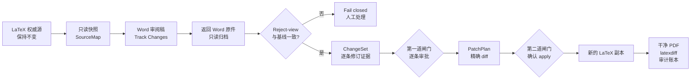

# LaTeX Word Review

[](https://github.com/JIE-jiee/latex-word-review/actions/workflows/ci.yml)
[](docs/compat/platform-support.md)
[](pyproject.toml)
[](LICENSE)

**把 Word 修订安全地带回 LaTeX，而不是把 Word 整篇再转一次。**

LaTeX Word Review 是一个面向 Windows 的审阅桥接工具。作者继续把 LaTeX 当作唯一权威源，
导师、合作者或审稿人可以在 Microsoft Word 中使用“修订”和“批注”。返回的 Word 不会直接
覆盖论文，而会先被解析成逐条变更，再经过人工审批、补丁预览和第二次应用确认。

> [!NOTE]
> 本项目源自一个真实的 LaTeX 与 Word 协作痛点，并主要通过维护者驱动的
> **Vibe Coding 与 OpenAI Codex 协作**完成。维护者提出需求、校正方向、设定安全边界并决定
> 发布；AI 编程 Agent 参与调研、设计、编码、测试和文档。Vibe Coding 是开发来源说明，
> 不是正确性保证。项目可信度应以公开源码、可复现测试、Windows CI、真实 Word 合同和审计
> 产物为准。完整说明见[开发来源与 Vibe Coding 记录](docs/development-provenance.md)。

> [!WARNING]
> 当前版本为 `0.1.0b2` beta 候选，公共契约为 `v1alpha`。项目仅支持 Windows 与
> CPython 3.12/3.13，尚未创建 GitHub Release，也没有发布到 PyPI。请固定到经过审核的
> commit，并先用副本和公开样例评估，不要把任意复杂 LaTeX 文档的全自动回填当作稳定承诺。

## 为什么需要它

常见的研究协作流程有一个断点：论文作者使用 LaTeX，导师或合作者只愿意在 Word 里修改。
LaTeX 转 Word 只能解决“能不能看和改”，不能解决“修改怎样安全回来”。

| 现实问题 | 常见处理方式的风险 | 本项目的处理 |
|---|---|---|
| 导师在 Word 中留下几十条修订和批注 | 作者手工逐条复制，容易漏改、错改，也难以复核 | 读取作者、时间、前后文本、批注范围和原始 OOXML 证据，生成 `ChangeSet` |
| 把修订后的 Word 整篇转回 LaTeX | 宏、公式、引用、标签、环境和期刊模板可能被改写 | 只把已批准且可精确定位的纯正文变更做成局部补丁 |
| Word 中关闭修订、接受全部修订或损坏锚点 | 可见正文修改的来源证据可能消失 | 对受支持的 text-patch 投影做 reject-view 对账，不一致就停止；格式、对象和关系另做人工完整性复核 |
| “接受修改”和“真正写入论文”混在一起 | 一次误点就可能改动源文件 | 审批与应用分成两道独立闸门，`plan` 默认只生成 diff |
| LaTeX 常直接引用 PDF 图片 | PDF 不适合直接嵌入 Word 审阅稿 | 在派生副本中把指定 PDF 页规范化为 PNG，原 PDF 和原 LaTeX 保持不变 |
| 交付后无法说明改过什么 | 只有最终 PDF，没有可追溯证据 | 同时生成干净修订稿、`latexdiff`、JSON/HTML 账本和可离线验证的审计包 |

## 核心创意

这个项目不是新的通用 LaTeX 转 Word 转换器。它复用
[`tex2word`](https://github.com/yfyang86/tex2word)、Pandoc、pypdfium2 等成熟能力，
把工程重点放在转换器通常不负责的往返审阅安全上。

1. **Word 是审阅界面，不是第二份源文件。** LaTeX 原稿始终保持权威和只读。
2. **修订先变成结构化数据。** 返回稿被拆成可核验的 `ChangeSet`，不是直接生成一篇新 LaTeX。
3. **定位必须可证明。** bookmark、SourceMap 和 UTF-8 字节范围把 Word 中的局部文字映射回源文件。
4. **审批不等于应用。** 用户先逐项决定，再查看精确 diff，最后另行确认写入新的工作副本。
5. **不能证明就转人工。** 公式、引用、结构、格式、move、批注和低置信度变更会入账，但不会冒险自动回填。



## 最终会得到什么

| 产物 | 用途 |
|---|---|
| `export/review.docx` | 带稳定 bookmark、启用 Track Changes 的 Word 审阅稿 |
| `receive/original/returned-original.docx` | 收到文件的只读归档，不作为可编辑工作文件 |
| `receive/changeset.json` | 插入、删除、替换、move、格式和批注的结构化证据 |
| `approvals/approval-rN.json` | 每项接受、修改后接受、拒绝、人工处理或冲突决定 |
| `plans/plan-r1/changes.patch` | 应用前必须检查的精确 unified diff |
| `revised-clean/` | 只包含已授权安全补丁的全新 LaTeX 工作副本 |
| `verification/revised-clean.pdf` | 修订后干净版本的编译结果 |
| `verification/latexdiff.tex` 和 `.pdf` | 原稿与修订稿的人类可视差异，不伪装成 Word 修订来源 |
| `ledger/ledger.json` 和 `.html` | 决定、补丁、哈希和核验结果的审阅账本 |
| `audit.zip` | 显式 allowlist、可离线验哈希和对象绑定的审计包 |

## 能自动做什么，什么会停下来

| 类别 | 当前行为 |
|---|---|
| 精确 bookmark 内的纯正文插入、删除、替换 | 可进入自动补丁候选，但仍需逐条审批和第二次应用确认 |
| 中文、emoji、重复文字 | 使用 UTF-8 字节坐标和 grapheme 边界检查，不靠全局模糊搜索 |
| Word 批注、作者、时间、move、格式修订 | 保留在变更和账本中，默认人工处理 |
| 公式、引用、标签、命令、环境、表格或图结构 | 记录证据，不自动改写 LaTeX 结构 |
| PDF 图片 | 对静态可解释的页、裁剪、旋转和尺寸生成规范 PNG 审阅预览 |
| SVG、EPS 或动态图片操作 | 默认转人工，不隐式执行外部转换器 |
| Accept All、关闭 Track Changes 后产生未跟踪可见正文、bookmark 损坏 | 在受支持的 text-patch 投影内基线对账失败并停止，不猜测修订来源 |
| 任意 Word 整篇转回 LaTeX | 明确不做 |
| 像素级复刻原 LaTeX 排版 | 不承诺，Word 文件的目标是可审阅和可定位 |

## 适合谁

适合：

- LaTeX 是正式源文件，但导师或合作者习惯 Word 的研究团队；
- 需要逐项决定修订，并保留作者、时间、批注和处理结果；
- 愿意把公式、引用和复杂结构留给人工确认；
- 希望核心 CLI 的文件处理在本机 Windows 上完成，并能复核每一步产物。

暂不适合：

- 需要无损双向同步任意 Word 与 LaTeX；
- 希望一键接受整篇 Word 并覆盖原稿；
- 依赖 Linux 或 macOS 的生产流程；
- 不准备检查 `changes.patch` 和人工处理项。

## 三种开始方式

### 1. 先跑公开样例

这是判断本机环境和核心闭环是否可用的最快方式。样例完全自制并使用 Apache-2.0 许可，
不读取私人论文，也不要求安装 Microsoft Word。

```powershell
git clone https://github.com/JIE-jiee/latex-word-review.git
Set-Location latex-word-review
uv sync --frozen --group fixture --extra pdf-figures --python 3.12
uv run --frozen python scripts/run_public_e0_cli_demo.py --skip-verification
```

若已安装 `latexmk`、XeLaTeX 和 `latexdiff`，去掉 `--skip-verification` 可继续生成两份 PDF、
账本和审计包。运行结果写入新的 `build/public-e0-cli-demo/<run-id>/`。详细说明见
[公开 E0 教程](docs/tutorial-public-e0.md)。

### 2. 处理真实论文

先阅读[中文 Windows 完整使用指南](docs/guide.zh-CN.md)，并按[安装和环境](#安装和环境)
定义当前 PowerShell 会话中的 `$Lwr`。核心命令顺序如下：

```powershell
& $Lwr workflow init C:\research\paper C:\review-runs\paper-r1 `
  --main main.tex --confidentiality local_private
Set-Location C:\review-runs\paper-r1
& $Lwr workflow export . --backend tex2word --confidentiality local_private
# 将 export\review.docx 交给审阅者
& $Lwr workflow receive . C:\received\reviewed.docx `
  --confidentiality local_private
& $Lwr approve init receive\changeset.json approvals\approval-r1.json `
  --actor-id maintainer --actor-name "Maintainer"
& $Lwr approve serve receive\changeset.json `
  approvals\approval-r1.json approvals --open-browser
# 审批完成后，使用页面给出的最新 approval-rN.json
& $Lwr plan snapshot objects\source-manifest.json receive\changeset.json `
  approvals\approval-rN.json plans\plan-r1 --confidentiality local_private
# 检查 plans\plan-r1\changes.patch 后，另行确认执行
& $Lwr apply snapshot plans\plan-r1 receive\changeset.json `
  approvals\approval-rN.json revised-clean
```

`workflow status` 只跟踪 `snapshot`、`export`、`receive` 三个高层阶段。开始逐条审批后，
请以每条命令返回的最新 sealed 对象和显式路径为准。

### 3. 让 Codex Skill 协助编排

仓库同时提供 Codex Plugin 和独立 Skill：

```powershell
codex plugin marketplace add JIE-jiee/latex-word-review --ref main
codex plugin add latex-word-review@personal
```

Plugin 中的 `$latex-word-review` Skill 会建立只读边界、按顺序调用同一套 CLI，并在两道
人工闸门处停止。Skill 只是编排层，转换、OOXML 解析、审批和补丁逻辑都在可独立运行的
Python 库和 CLI 中。可复现使用应把 marketplace 固定到已审核的 tag 或 commit；当前尚无
正式 tag，跟随 `main` 只适合评估。

核心 CLI 不会主动上传论文。Codex Skill 是可选的 AI 编排入口，Agent 可能按所用 Codex
产品和组织的数据政策接触命令输出、before/after、作者或批注。`local_private` 只是产物分类，
不是加密或网络隔离。敏感论文应先确认适用的数据政策，必要时只使用本地 CLI。

## 安装和环境

最低环境：

- Windows；
- CPython 3.12 或 3.13；
- [uv](https://docs.astral.sh/uv/) 或 pip；
- 真实审阅时由审阅者使用 Microsoft Word for Windows。

从源码建立锁定环境：

```powershell
git clone https://github.com/JIE-jiee/latex-word-review.git
Set-Location latex-word-review
$ReviewedCommit = "PASTE_THE_REVIEWED_40_CHARACTER_COMMIT_SHA_HERE"
git checkout --detach $ReviewedCommit
if ((git rev-parse HEAD).Trim() -ne $ReviewedCommit) { throw "Commit verification failed" }
uv sync --frozen --group fixture --extra pdf-figures --python 3.12
$VenvScripts = (Resolve-Path .\.venv\Scripts).Path
$env:PATH = "$VenvScripts;$env:PATH"
$Lwr = (Resolve-Path "$VenvScripts\latex-word-review.exe").Path
& $Lwr --version
& $Lwr doctor
```

运行前把 `$ReviewedCommit` 替换为你在 GitHub 上审核过的完整 40 位 commit SHA。占位值会让
`git checkout` 明确失败，避免不知情地继续跟随最新 `main`。

也可以把当前源码安装到 Python 环境：

```powershell
py -3.12 -m venv .venv
$VenvScripts = (Resolve-Path .\.venv\Scripts).Path
$env:PATH = "$VenvScripts;$env:PATH"
& "$VenvScripts\python.exe" -m pip install ".[pdf-figures]"
& "$VenvScripts\python.exe" -m latex_word_review doctor
```

`pdf-figures` extra 安装 pypdfium2/Pillow，只用于派生 PDF 页面预览。它不会自动安装
Microsoft Word、MiKTeX、Pandoc 或其他外部程序。生成 `revised-clean.pdf` 和
`latexdiff.pdf` 还需要可用的 `latexmk`、对应 TeX 引擎和 `latexdiff`。缺少工具时会报告
`blocked` 或 degraded 状态，不会伪报完整成功。

## 两道审批闸门怎样工作

第一道闸门只记录用户意图：

| 决定 | 含义 |
|---|---|
| `accepted` | 同意返回稿中的文字，但是否能自动应用仍由安全策略决定 |
| `accepted_with_edit` | 同意修改方向，并由用户给出最终文字 |
| `rejected` | 不进入补丁 |
| `manual` | 保留证据，由用户在 LaTeX 中人工处理 |
| `conflict` | 当前证据或上下文存在冲突，暂不自动处理 |

浏览器审批页只绑定 `127.0.0.1`。每次决定会生成新的不可变 ApprovalSet revision；
`finalize` 要求所有变更都有决定。即使某项被标为 `accepted`，公式、结构或不精确定位仍会
进入 `accepted_but_blocked`。

第二道闸门发生在 `plan` 之后。任何 `accepted_but_blocked` 都会使计划状态变为 `blocked`
并阻止应用；用户需要回到审批，把这些项目改为 `manual` 或 `rejected`，再生成新计划。
计划为 `ready` 或 `noop` 后，用户检查 `changes.patch` 和 planned operations，再单独执行
`apply`。`apply` 会重新核对哈希和字节范围，只能写入一个尚不存在的新目录，不能覆盖原稿
或 snapshot。

## PDF 图片如何进入 Word

LaTeX 中的 PDF 图片仍保留为 PDF。导出 Word 前，工具在派生 overlay 中解析静态
`\includegraphics` 引用，把指定页、裁剪、旋转和尺寸物化到规范 PNG，再让
Word 使用这个 PNG 预览。这样做有三个明确结果：

- 原始 `.tex` 和 PDF 文件不变；
- Word 中看到的是栅格化审阅图，不是可继续编辑的矢量 PDF；
- 页码、裁剪、像素尺寸、渲染器版本、源哈希和 PNG 哈希会进入证据。

导出还检查 DOCX 图片实例数不低于 LaTeX 图片引用数。这个检查能发现明显静默丢图，
但不能证明 Word 排版与 LaTeX PDF 像素级一致。

## 安全模型

- 权威 LaTeX、导出基线和收到的 Word 原件以 SHA-256 绑定并保持不变。
- `ingest` 必须证明返回稿在 `verified_for_text_patch` 范围内的 reject-view 与导出基线一致；
  格式、OMML、图片、超链接目标、content control、custom XML 和嵌入对象仍需人工复核。
- 自动补丁只允许精确、置信度至少 0.99 的纯正文候选。
- LaTeX 结构字符、非普通空格、换段、grapheme 截断、重叠或漂移会被拒绝。
- 外部命令使用固定 argv、无 shell、最小环境、超时和输出上限。
- TeX 只在私有副本中以 `-no-shell-escape` 运行。
- 审计 ZIP 只包含显式 allowlist 项，并检查路径、哈希、对象绑定和常见隐私泄漏。

详细威胁模型见 [Security model](docs/security/threat-model.md)，领域对象和状态机见
[Domain contracts](docs/architecture/domain-contracts.md)。

## 依托哪些项目

项目遵循 adopt、wrap、contribute、self-build 的顺序，先核查可复用上游，再决定是否自研。

| 上游 | 本项目怎样使用 |
|---|---|
| [`tex2word`](https://github.com/yfyang86/tex2word) | 默认 LaTeX 到 DOCX 后端，复用解析、OMML、图片、表格、字段和报告能力 |
| [Pandoc](https://pandoc.org/) | 可选对照转换后端；修订读取只做过契约实验，未接入生产 ingest |
| [docx-revisions](https://github.com/balalofernandez/docx-revisions) | 上游契约实验和设计参考，未作为生产依赖或 ingest 读取器 |
| [pypdfium2](https://github.com/pypdfium2-team/pypdfium2) | Windows 上的固定版本 PDF 页面渲染器 |
| Open XML SDK、PowerTools、Docxodus | OOXML 规范和差分 oracle 参考，不引入默认 .NET 运行依赖 |

本项目自行负责不可变运行、SourceMap、reject-view 基线、版本化 Schema、逐条审批、局部补丁、
核验和审计链。完整许可证、维护状态、测试结果与决策见
[上游依赖矩阵](docs/compat/upstream-dependency-matrix.md)、
[ADR-0001](docs/adr/0001-upstream-strategy.md) 和
[成熟化复用审查](docs/reviews/maturity-upstream-reuse-2026-07.md)。

## 当前验证证据

仓库提供以下公开证据。自动化门禁的结果以目标提交的 GitHub Actions 页面为准；需要专有
Microsoft Word 的合同另有本机记录：

- Windows 上的 Python 3.12/3.13 锁定依赖、lint、format、mypy 和完整 pytest；
- 合成 E0 语料的导出、修订、审批、应用、验证、账本与审计包闭环；
- 真实 Microsoft Word COM 合同，包括正常修订、关闭修订、Accept All 和 bookmark 损坏，
  记录见 [Word contract harness](docs/reviews/word-contract-harness.md)；
- 固定 MiKTeX 包闭包下的真实 XeLaTeX、latexmk 和 latexdiff；
- wheel/sdist 构建、clean install、CLI smoke test 和 Plugin/Skill 一致性检查。

公开测试只使用自制、脱敏或可再分发材料。私人论文仅作为本地且 Git 忽略的压力测试。
测试记录见 [`docs/reviews/`](docs/reviews/)，发布证据边界见
[artifact-evidence.md](docs/release/artifact-evidence.md)。

## 文档导航

- [完整文档索引](docs/README.md)
- [中文 Windows 完整使用指南](docs/guide.zh-CN.md)
- [English Windows Quick Start](docs/quick-start-windows.md)
- [开发来源与 Vibe Coding 记录](docs/development-provenance.md)
- [公开 E0 可执行教程](docs/tutorial-public-e0.md)
- [CLI 与运行目录契约](docs/reference/cli.md)
- [本地浏览器审批](docs/reference/review-server.md)
- [计划与安全应用](docs/reference/plan-and-apply.md)
- [编译、账本与审计包](docs/reference/verification-and-bundle.md)
- [平台支持矩阵](docs/compat/platform-support.md)
- [v0.1 功能边界](docs/compat/v0.1-scope.md)
- [安全威胁模型](docs/security/threat-model.md)

## 项目结构

- `src/latex_word_review/`：独立 Python 库、CLI、Schema 和后端适配器。
- `tests/fixtures/e0-minimal-paper/`：可重建的公开 DOCX/LaTeX 契约语料。
- `tests/`：单元、安全、契约、CLI 集成和公开端到端测试。
- `docs/adr/`：上游 adopt/wrap/contribute/self-build 决策。
- `docs/reference/`：公开接口、领域契约和安全不变量。
- `skills/latex-word-review/`：只编排 CLI 的 canonical Codex Skill。
- `plugins/latex-word-review/`：可安装 Codex Plugin。
- `samples/private/`：仅本地压力测试，Git 默认忽略。

## 已知限制

- 自动应用只覆盖精确定位的纯正文，不覆盖任意宏、复杂表格、自定义类或期刊模板。
- Word 审阅稿是派生视图，不保证复刻 LaTeX PDF 的分页和版式。
- 格式、段落标记、OMML、图片、超链接目标、content control 和嵌入对象仍需人工完整性复核。
- 公共隐私扫描只能发现常见路径和秘密模式，不能替代人工隐私与版权检查。
- Linux 和 macOS 不属于开发、CI、发行或故障排查承诺。
- 当前没有正式 tag、GitHub Release 或 PyPI 包。源码版本不等于已发布版本。

## 开发与贡献

```powershell
uv sync --frozen --group fixture --extra pdf-figures --python 3.12
uv run --frozen ruff check .
uv run --frozen ruff format --check .
uv run --frozen mypy
uv run --frozen pytest --cov=latex_word_review --cov-report=term-missing
uv run --frozen python scripts/qa_e0_public_fixture.py --output-dir build/fixture-qa
```

提交前请阅读 [CONTRIBUTING.md](CONTRIBUTING.md)、[SECURITY.md](SECURITY.md) 和
[THIRD_PARTY_NOTICES.md](THIRD_PARTY_NOTICES.md)。使用 AI 辅助提交并不免除贡献者的责任：
提交者应理解变更、披露重要的 AI 参与、提供可复现验证，并对最终内容负责。

可复现的非敏感问题请提交到
[GitHub Issues](https://github.com/JIE-jiee/latex-word-review/issues)。安全问题不要公开披露，
请使用[GitHub 私密漏洞报告](https://github.com/JIE-jiee/latex-word-review/security/advisories/new)。
代码、原创文档和公开 fixture 使用 [Apache License 2.0](LICENSE)。
